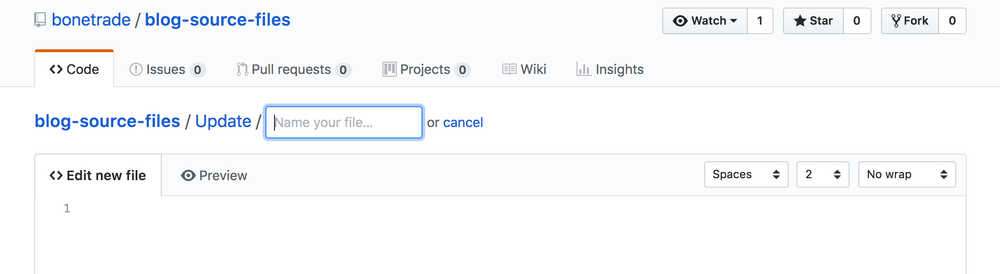

+++
title= "Adding New Content Via Github"
date= 2018-04-30T11:30:45-04:00
description = "A workflow for writing new content on a gh-pages hosted site"
weight = 40
+++

This project website, its public face, is generated using Blogdown. Blogdown itself is built on Hugo, a generator for static websites from simple textfiles. The reason that we use the Blogdown version is that it can handle text written in R-Markdown. And why does R-Markdown matter? This is a version of the markdown text file that can have embedded R code in it, which R can run when the site is generated - and so we can integrate analytical code into our writing.

Remember when your math teacher said, 'show your work'? Turns out, that is profoundly important for reproducibility and replicability in research. Given that we work at public institutions, using public money, we rather think that's important.

The other nice aspect to using simple text files, a site generator, and Github, is that all of our writing and research is kept under version control. Github allows us to edit files directly on their website, which is handy for quick things like a blog post.

### Getting started

1. Make sure you have a [github](http://github) account.
2. Make sure that you are added as a member of the organization that controls the repo in question - in this case, ['blog source files'](https://github.com/bonetrade/blog-source-files). (On Shawn's computer, he's got the 'content' subfolder of the blogdown folder under version control).
3. Organizations you belong to will be shown to the bottom left of the screen when you're on your own Github profile page. Once you're a member, login to Github and navigate directly to the repo. So, make sure you're in `blog-source-files`. You now have displayed the list of folders from which the content of this site is created.

### Writing

1. Click on the 'Updates' folder. This is the blog portion of this site.
2. Click on 'create new file'
3. You should see the editor, like so:



To make writing a bit more pleasant, tick the 'no wrap' dropdown at the right hand side and select 'soft wrap'. 

Give the blog post a name where the first part is the date, eg: `2018-05-03-learning-a-new-tool.md`. The `.md` part tells us that this is a text file written in the markdown format. Please don't forget that!

Make sure that the first text you write is the post **metadata**, which follows the pattern below (this is 'toml' format, by the way):

```
+++
title= "Getting Started!"
date= 2018-04-16T15:16:31-04:00
description = "getting started"
draft= false
+++

2018-04-16

### Getting Started!

We are pleased to announce....

```

And that's all there is to it. Follow [markdown conventions](https://daringfireball.net/projects/markdown/syntax). **WARNING** Nothing is saved as you type. To save your work, you have to make a 'commit':

.

Give your commit a short descriptive message - this will appear in the list of 'snapshots' that comprise the history of this repository - and add a longer message if you like. Commit directly to the master branch.

### Adding images

Any images you want to have appear in the post need to be in this folder as well. In your text, you can add an image using markdown like so: `` . Then, after you've committed your text, drag-and-drop your image into the repo (literally drag it onto the list of files in this folder). You'll be asked to make a commit message for this too.

### R markdown

Writing an R markdown post works exactly the same way as everything else described above; just make sure that you follow the conventions correctly. Any data files that you want to use in your R markdown should be uploaded to this repository (ie they were in the same working directory when you wrote the R markdown, so they should be in the same folder in the repo when I build the website).
